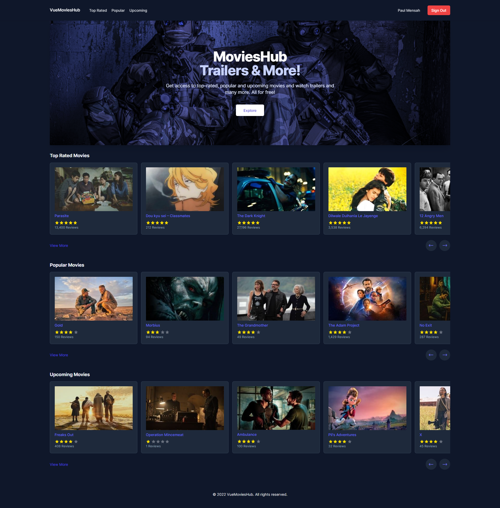

## MoviesHub Vue App

```bash
# install dependencies
$ yarn install

# serve with hot reload at localhost:3000
$ yarn dev

# build for production and launch server
$ yarn build
$ yarn start

# generate static project
$ yarn generate
```

## Backend Api Project
```bash
# clone the dotnet api project and follow instructions to run
$ git clone https://github.com/devpaulmensah/movieshub-api.git
```

## Preview



